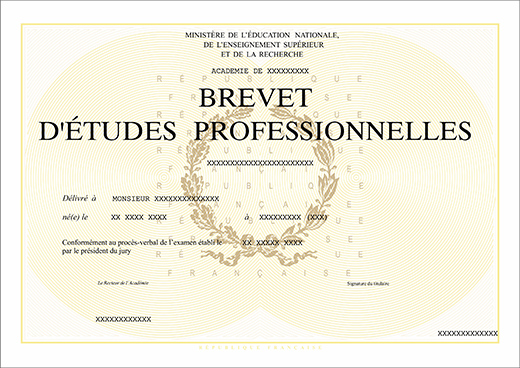
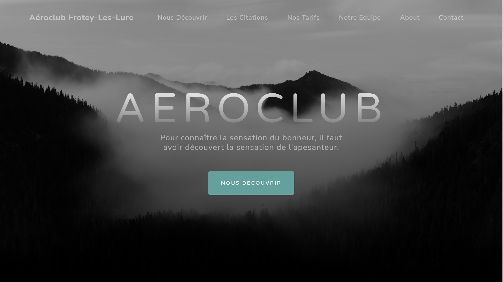
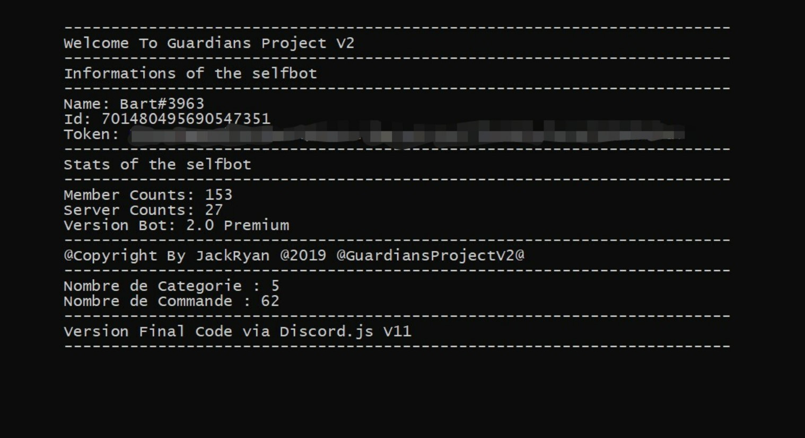

  <!-- Header -->

  <header class="masthead d-flex">
    

      <h1 class="mb-1 shake3">Portfolio - Enzo</h1>
      <h3 class="mb-5 twist3">
        <em>Explore My Life</em>
           
      </h3>
      <h2 class="mb-7">
      <button id='start'>With Effect ?</button>
      <button id='stop'>Stop Effect</button>
      <button id='mic'>Use Microphone</button>
       
      
♫

      </h2>
      <a class="btn btn-primary btn-xl " href="#about">Let's Go</a>
    

    

  </header>

  <!-- Fin HEADER -->

  <!-- Debut parti ABOUT avec les différents Image :) -->

  <section class="content-section bg-etude" id="about">
    

      

        

          <h2>My school career</h2>
           
          

            

              <a class="portfolio-item" data-toggle="modal" data-target="#bep">
                

                  

                    <!-- Si tu souhaite écrire quelque chose -->
                  

                

                
              </a>
            

            

              <a class="portfolio-item" data-toggle="modal" data-target="#bac">
                

                  

                    <!-- Si tu souhaite écrire quelque chose -->
                  

                

                
              </a>
            

            

              <a class="portfolio-item" data-toggle="modal" data-target="#bts">
                

                  

                    <!-- Si tu souhaite écrire quelque chose -->
                  

                

                
              </a>
            

          

             
          <a class="btn btn-dark btn-xl " href="#projects">My various projects</a>
        

      

    

  </section>

  <!-- FIN DE LA PARTIE -->

  <!-- DEBUT DE UNE FOIS QUE QUELQUN CLICK SUR L'UNE DES IMAGES OUVRE UN MODAL .. -->

  

    

      

        

          <h5 class="modal-title" id="exampleModalLabel">Obtaining BEP</h5>
        

        

          
 <!-- ECRIRE ICI plus tard --> 

        

        

          <button type="button" class="btn btn-primary" data-dismiss="modal">Close</button>
        

      

    

  

  

    

      

        

          <h5 class="modal-title" id="exampleModalLabel">Obtaining BAC</h5>
        

        

          
 <!-- ECRIRE ICI plus tard --> 

        

        

          <button type="button" class="btn btn-primary" data-dismiss="modal">Close</button>
        

      

    

  

  

    

      

        

          <h5 class="modal-title" id="exampleModalLabel">Currently a student in bts</h5>
        

        

          
 <!-- ECRIRE ICI plus tard --> 

        

        

          <button type="button" class="btn btn-primary" data-dismiss="modal">Close</button>
        

      

    

  

  <!-- FIN DE LA PARTIE -->

  <section class="content-section bg-project" id="projects">
    

      

        <h2 class="mb-5">Recent Projects</h2>
      

      

        

          <a class="portfolio-item" href="https://github.com/Enzo2911/Site-AEROCLUB">
            

              

                
Template Bootstrap 
                  remake by Me !

              

            

            
          </a>
        

        

          <a class="portfolio-item" href="https://github.com/Enzo2911/ProjectGuardians-V2-Premium">
            

              

                
SelfBot Fully coded by me with nodejs (discors.js V11) now OpenSource

              

            

            
          </a>
        

        <!--
        

          <a class="portfolio-item" href="#!">
            

              

                
Strawberries

                
Strawberries are such a tasty snack, especially with a little sugar on top!

              

            

            
          </a>
        

        

          <a class="portfolio-item" href="#!">
            

              

                
Workspace

                
A yellow workspace with some scissors, pencils, and other objects.

              

            

            
          </a>
        

        -->
      

    

  </section>

  <!-- Footer -->
  <footer class="footer text-center bg-footer">
    

      <ul class="list-inline mb-5">
        <li class="list-inline-item">
          <ul class="social-network social-circle">
            <li><a href="https://github.com/Enzo2911" class="icoGithub" title="Github"><i class="fab fa-github"></i></a></li>
        </ul>
        </li>
      </ul>
      
Copyright &copy; PortFolio-Enzo 2021

    

  </footer>